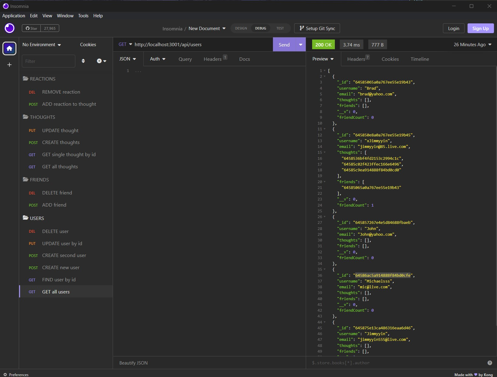

# E-Chatter

## Description 

This is an API for a social network web application called E-Chatter, where users can share their thoughts, react to friends’ thoughts, and create a friend list.

  
## Installation

Some installation packages is needed to run this application in command-line.

Please be sure to have the following installed prior to running this application:

-Install node version v16.18.0 by following instructions here:

https://coding-boot-camp.github.io/full-stack/nodejs/how-to-install-nodejs

-Run the following

npm install

## Usage
-Access application in terminal.

-type "node index.js" to start.

Ypu will need to have Insomnia installed to test and can be downloaded here:  https://docs.insomnia.rest/

Please view the video demo link below to see how to use the application:

<a href="https://drive.google.com/file/d/1fRMm6_ypwsbJhIsQ3bRWI9vye3A7QCMh/view">E-Chatter DEMO</a>

    

## Credits
https://www.mongodb.com/docs/compass/current/documents/view/

https://mongoosejs.com/docs/api/model.html

https://stackoverflow.com/

UW BOOTCAMP COURSE

https://docs.insomnia.rest/

Tutoring